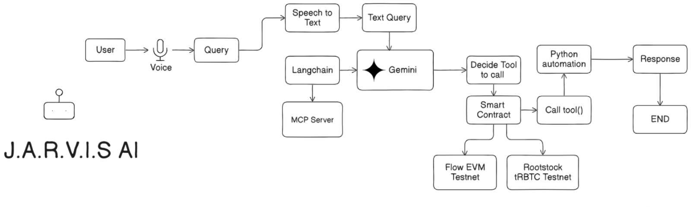

# Jarvis AI Voice Automation Tools

_Your Personal AI Agent for Web3 Automation_

Jarvis AI is an intelligent automation framework that simplifies your Web3 workflows.
From creating blockchain transactions to fetching on-chain/off-chain data, building personalized investment strategies, and automating DeFi tasks — Jarvis AI acts as your **all-in-one Web3 assistant**.

---
### Demo Video: https://youtu.be/jw-5U1CIpFI?si=RWa5DaJm1aWvZ0Sl

---

## ✨ Architecture

---

## ✨ Features

* 🎙️ **AI Voice Assistant** – Perform blockchain actions via natural voice commands.
* 🔗 **Multi-Chain Transactions** – Supports deployment and interactions on various blockchains.
* 📜 **Smart Contract Management** – Deploy and execute smart contracts with ease.
* 📂 **Decentralized Storage** – Integrated with Filecoin for secure and distributed data storage.
* 📊 **Transfer History Checker** – Instantly retrieve and analyze wallet transaction history.
* 🧠 **LangChain Integration** – Enhanced AI-driven conversational workflows.
* ⚡ **FastAPI MCP Server** – High-performance server implementing Model Context Protocol (MCP) for AI + blockchain orchestration.

---

## 🤝 Integrations

### **🔗 Rootstock Integration**

Jarvis AI integrates Rootstock (RSK) to enable smart contract execution and Web3 automation on a Bitcoin sidechain. We deployed a contract on the Rootstock testnet and executed on-chain transactions to validate functionality, demonstrating seamless task automation such as transaction creation and strategy execution on Rootstock.

- **TRBTC Smart Contract Deployment** : We deployed a TRBTC (Testnet R-BTC) smart contract on Rootstock testnet. This enables Jarvis AI to interact with Rootstock assets directly.

- **Block Explorer Data** : Jarvis AI integrates Rootstock’s block explorer APIs, allowing users to fetch transaction history, balances, and contract data in real-time.

- **Automated Transactions** : Jarvis AI automates contract interactions by executing transactions on Rootstock without manual intervention.

- **User Data Fetching** : The AI agent fetches Rootstock account data (balances, activity, and contract states) to enable personalized automation strategies.

- **Smart Contract Deployment Address** : `0xcbdAf17Cc7743a221FDF800e8F9Da7a3Effe4F42` 

### **Flow.com**

🌊 Flow Integration

Jarvis AI integrates with Flow, a Layer 1 blockchain designed for consumer-scale crypto applications. Leveraging Cadence smart contracts and EVM equivalence, we deployed and tested transactions on the Flow Testnet, validating Jarvis AI’s ability to automate Web3 tasks Solidity-based contracts.

- **Smart Contract Deployment**: A contract was deployed on Flow Testnet to confirm compatibility with Jarvis AI automation flows.

- **Transaction Automation**: Jarvis AI executes transactions on Flow seamlessly, handling EVM contracts.

- **Data Fetching**: Integrated Flow APIs allow Jarvis AI to fetch user balances, contract states, and transaction history.

- **Scalability Benefits**: Flow’s multi-role architecture and ACID-compliant environment ensure fast, developer-friendly execution, enabling AI-driven consumer-grade apps at scale.

Deployed Contract Address (Testnet): `0xD60F71FABc744eAACb6D55a88Eb2dc7029C7db46`

### **Filecoin** 

Jarvis AI integrates with Filecoin Onchain Cloud, utilizing the Lighthouse SDK to access decentralized warm storage. This allows Jarvis AI to combine blockchain automation with decentralized data persistence and economic models.

- **Lighthouse SDK for Storage**: We integrated Filecoin warm storage to persist user-generated content securely and verifiably.

- **Transaction Automation with Payments** : Jarvis AI uses Filecoin’s USDFC payment rails to enable pay-per-use models for tasks like strategy execution and dataset access.

- **PDP Verification** : We implemented **Proof of Data Possession (PDP)** both for hot storage reliability (ensuring providers maintain instantly available data) and for automation completion verification, giving users cryptographic proof that their automated process has been successfully executed.

Smart Contract Deployment Address: `0x7bD03903d8E14806741d121282A53d398a075785`

---

## 🛠️ Tech Stack

* **Smart Contracts**: Solidity
* **Frontend**: React.js
* **Backend APIs**: Node.js, FastAPI MCP Server
* **AI & Automation**: Python, PyAutoGUI, LangChain
* **Blockchain Dev Environment**: Hardhat
* **Voice AI Processing**: Python-based voice recognition + MCP integration

