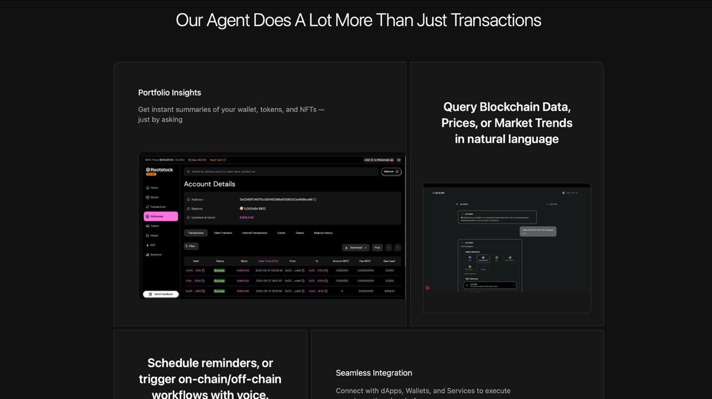
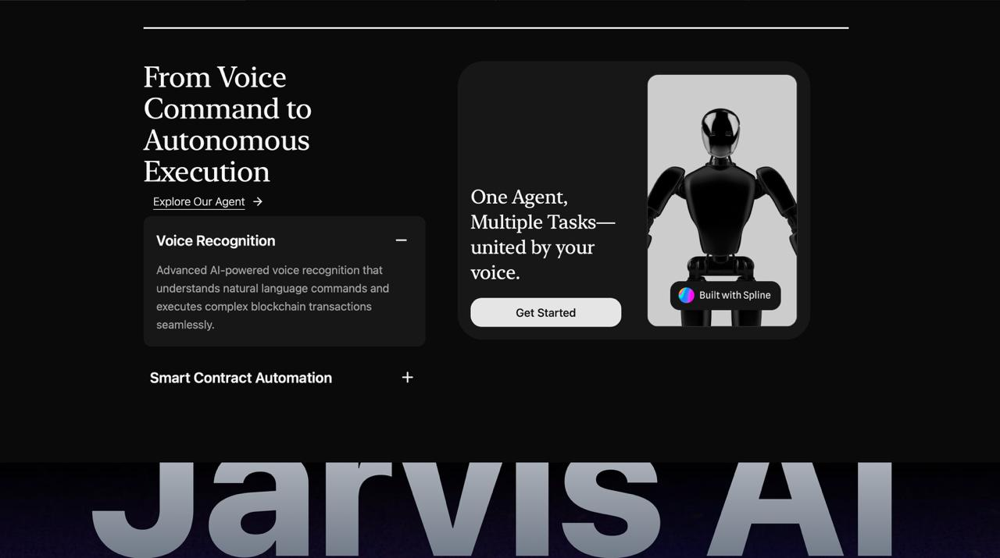
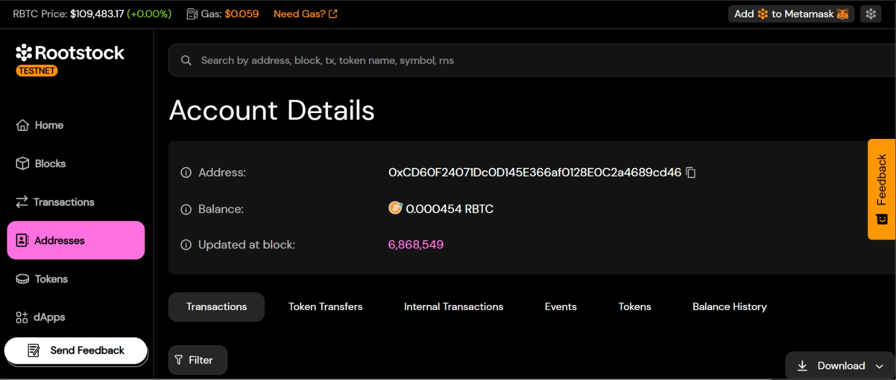

# Jarvis AI – UI

This folder contains the **frontend UI** for **Jarvis AI**, a blockchain-focused AI voice assistant that allows users to interact with wallets, smart contracts, and decentralized services using natural language and voice commands.

The UI is built using **React**, **TypeScript**, and **Vite**, providing a fast development experience with modern tooling.

---

## ✨ Features

* **Portfolio Insights**: Get instant summaries of wallets, tokens, and NFTs.
* **Natural Language Queries**: Ask about blockchain data, token prices, and market trends.
* **Voice Recognition**: Execute commands and transactions with AI-powered speech-to-text.
* **Smart Contract Automation**: Trigger workflows on-chain and off-chain.
* **Seamless Integration**: Works with dApps, wallets, and external services.
* **Modern UI/UX**: Built with responsive layouts, dark theme, and modular components.

---

## 🛠️ Tech Stack

* **React 18** – UI framework
* **TypeScript** – Strongly typed JavaScript
* **Vite** – Next-generation frontend build tool
* **TailwindCSS** (if used) – Utility-first styling
* **Spline** (3D assets integration)

---

## 📂 Folder Structure

```
ui/
│── public/             # Static assets
│── src/
│   ├── assets/         # Images, icons, 3D models
│   ├── components/     # Reusable UI components
│   ├── pages/          # Page-level components
│   ├── hooks/          # Custom React hooks
│   ├── context/        # Global state/context providers
│   ├── services/       # API & blockchain service calls
│   ├── types/          # TypeScript type definitions
│   ├── App.tsx         # Root component
│   └── main.tsx        # Entry point
│── index.html
│── tsconfig.json
│── vite.config.ts
│── package.json
│── README.md           # This file
```

---

## 🚀 Getting Started

### 1. Install Dependencies

```bash
cd ui
npm install
```

### 2. Run Development Server

```bash
npm run dev
```

The app will be available at: **[http://localhost:5173](http://localhost:5173)**

### 3. Build for Production

```bash
npm run build
```

### 4. Preview Production Build

```bash
npm run preview
```

---

## 📸 UI Preview

Here are some screenshots of the Jarvis AI UI:

### Portfolio Insights



### Query Blockchain Data



### Voice Command to Execution



---

## 🔌 Integration Notes

* Connects with **Rootstock** and other blockchain APIs.
* Uses **FastAPI MCP Server** for backend communication.
* Can be extended to interact with multiple dApps and services.

---

## 🤝 Contributing

1. Fork the repo
2. Create a feature branch (`git checkout -b feature-name`)
3. Commit changes (`git commit -m "Add new feature"`)
4. Push to branch (`git push origin feature-name`)
5. Open a Pull Request

---

## 📜 License

This project is licensed under the **MIT License** – feel free to use and modify.

---

## 👨‍💻 Authors

* Built by the **Jarvis AI Team**
* Sponsors: [Flow.com](https://flow.com), Rootstock, Filecoin

---
